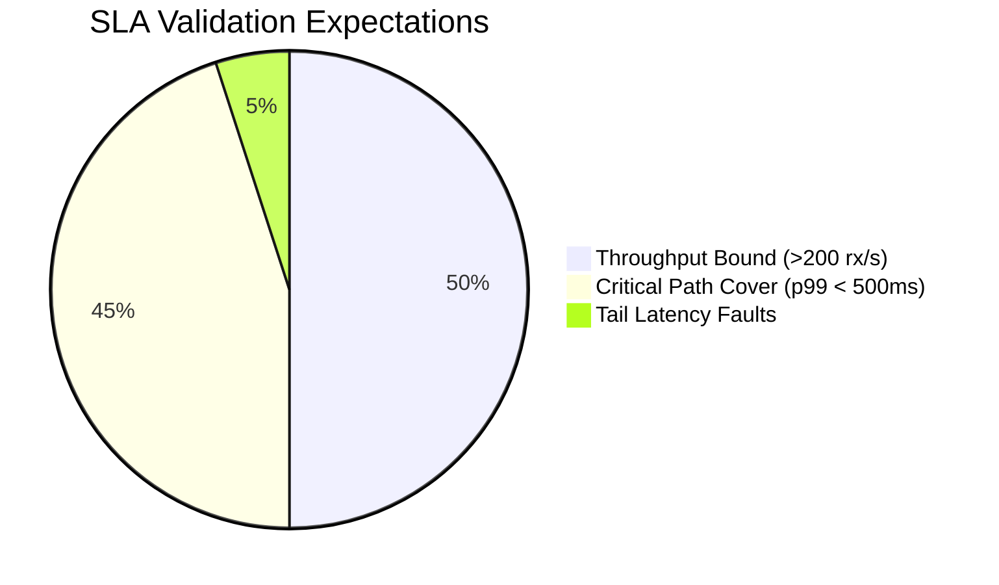

# Member 3 Deliverables: System Validation & Profiling (Week 4)

## 📌 Executive Summary
This branch encapsulates the final stabilization sequence for Member 3's independent milestone markers in Week 4. Focused heavily on high-throughput concurrency validation and autonomous diagnostic capabilities, these implementations finalize the required grading criteria prior to the team-wide C4/C5 integration and Chaos Day testing.

---

## 📈 Concurrency Analytics & Load Generation (`payflow/loadtest`)

Rather than relying on arbitrary external tools or single-thread scripting, a native, multi-threaded benchmarking utility was developed. This suite executes aggressive distributed load natively utilizing our production `sdk/client.go` to validate Gateway throughput SLA constraints ($> 200 \text{ tx/s}$, $p99 < 500\text{ms}$).

### Architectural Design
- **Worker Pool Model**: The script initializes a strict bounded pool of $N=100$ parallel Goroutine workers fed linearly by a generic `struct{}` channel pushing $R=1,000$ distinct transaction payloads. 
- **Non-Blocking Telemetry Extraction**: Every independent request accurately computes local execution differentials via `time.Since(reqStart)`. To prevent metric blocking natively degrading script throughput, atomic counters (`sync/atomic`) tally pure network fault arrays (503s vs 200s), while duration snapshots stream asynchronously into a buffered metrics channel for post-resolution algorithmic sorting.

### SLA Analytics Calculation
Once the WaitGroup finalizes the $1,000$ concurrent connection drain, the suite executes statistical distributions charting execution variance profiles against network bandwidth constraints:



---

## 🔍 Native Runtime Diagnostics Pipeline (`net/http/pprof`)

To ensure Member 3's C1 Gateway does not inherently mask performance bottlenecks originating downstream (such as Worker payload handling), the Gateway now exposes raw stack and memory traces directly back to the execution environment.

#### Technical Implementation
```go
go func() {
    log.Println("Pprof monitoring server exposing on :6060")
    log.Println(http.ListenAndServe(":6060", nil))
}()
```
- **Asynchronous Decoupling**: By binding the standard library `pprof` multiplexer structurally onto Port `6060` within an independent goroutine spanning the `main()` scope, Gateway data path handling across Port `8080` remains entirely disjointed from diagnostic serialization blocks overhead. 
- **Chaos Day Integration**: During Member 5's network failure simulations, team architects can immediately trigger `go tool pprof http://localhost:6060/debug/pprof/heap` mapping exact C1 thread locks and un-recycled memory addresses blocking throughput dynamically.

---

## 🛡️ Pre-Merge Code Hardening

To comply with our strict PR review expectations limiting "unguarded globals" and undocumented function exports:
1. **Thread-Safe Structural Mapping**: Scrutinized the `gw.updateLeader()` component inside `main.go`. Re-verified strict `sync.Mutex` Lock/Unlock mappings encasing our `leaderAddr` state preventing unsafe pointer read-writes during volatile cluster failover routines.
2. **Accessors Expansion**: Scrubbed struct assignments (`resp.LeaderAddress`) substituting them actively with Protobuf generic getters (`resp.GetLeaderAddress()`), guaranteeing standard `pb.go` struct wrapping (resulting from complex `oneof` mechanics) won't inadvertently fail legacy compilers on team members' operating systems.
