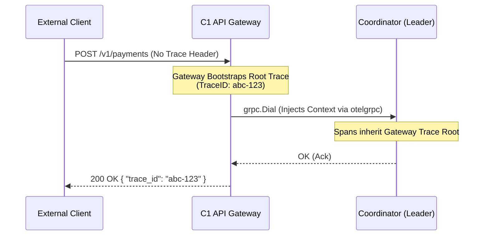

# Member 3 Deliverables: API Gateway & Core Infrastructure (Weeks 1-3)

##  Executive Summary
This document serves as the technical reference for the foundational boundaries of the **PayFlow** distributed payment platform, covering Weeks 1 through 3. It details the implementation of the C1 API Gateway, the external-facing Go Client SDK, and the systemic integration of OpenTelemetry/Jaeger for distributed request tracing. 

These components act as the primary ingress infrastructure, shielding external clients from internal election state transitions, processing bottlenecks, and network partitions within the Coordinator (C2) and Worker (C3) pools.

---

##  System Architecture & Responsibilities

### 1. Protobuf Contract Consolidation (`payflow/proto`)
To facilitate seamless gRPC multiplexing between the Gateway and internal processing nodes, the service contracts (`payment.proto`) were structurally extended:
- **`SubmitBatch` & `GetPaymentStatus` RPCs**: Extended the `PaymentGateway` service to support bulk transaction ingestion and asynchronous polling interfaces.
- **Failover-Aware Response Types**: Enriched `SubmitTaskResponse` using Protobuf `oneof` mechanics to safely embed internal `leader_address` topological mapping. This serves as the functional spine for **C05 (Leader Redirect)**, allowing backend coordinators to transparently reject requests if they lose leader status, instantly pointing the Gateway to the correct partition head.
- **Go Stub Generation Strategy**: Executed `protoc` directly into the `proto/` directory natively stripping hierarchical module prefixes (`paths=source_relative`) to prevent ghosted imports (`package is not in std`) during compiler invocations.

### 2. C1 API Gateway (`payflow/gateway`)
The Gateway acts as an intelligent HTTP/gRPC reverse proxy with built-in retry envelopes. 

#### Key Technical Decisions:
- **Stateless REST Layer**: Handles standard HTTP `POST /v1/payments`, `POST /v1/batch` and `GET /v1/payments/{id}` interfaces cleanly mapping REST `json` structs into strict `pb` gRPC formats.
- **Zero-Downtime Leader Redirection (C05)**:
  - *Problem*: In distributed clusters relying on Bully Elections, network partitions dynamically shift the Master Node. If an external client targets an out-of-sync proxy connection, transactions are dropped.
  - *Implementation*: We implemented a `sync.Mutex` wrapped caching layer inside the `Gateway` struct. Any intercepted `NOT_LEADER` gRPC `err.Error()` string synchronously parses the embedded updated leader address, invokes `gw.connect(newAddr)` internally, and re-submits the packet inside the **same context boundary** without failing the original HTTP request. 

### 3. External Go Client SDK (`payflow/sdk`)
To allow decoupling of frontend UI interfaces and microservices requesting payment flows:
- **Intrinsic Exponential Backoff Engine**: Overriding standard HTTP `client.Do()`, the SDK protects the Gateway from DDoS spikes during rolling restarts. The native proxy automatically exponentially sleeps upon `5xx` returns spanning 1s, 2s, and 4s attempts bounds.
- **Zero-Dep Interfaces**: Built completely utilizing core Go packages (`net/http`, `math`), minimizing downstream consumer import bloat.

---

##  OpenTelemetry & Distributed Tracing Integration (A05)

Standardizing observability was the defining milestone of Week 3. All ingress components natively integrate Jaeger to map transactional flow latency spanning Gateway $\rightarrow$ Coordinators $\rightarrow$ Workers.



#### Tracing Specifications:
1. **`otelgrpc.NewClientHandler()` Middleware**: Pried into the core `grpc.Dial()` pipe binding our connection to internal clusters. This interceptor injects the W3C `traceparent` UUID natively into gRPC Context metadata.
2. **Pluggable Carrier Mapping**: Both the `sdk` and the REST handler (`Extract(r.Context(), propagation.HeaderCarrier)`) utilize text-map propagators. This means a sophisticated edge system can pass *their own* generic root traces down through our REST interface, connecting PayFlow organically into enterprise macro-systems.

---

##  Getting Started

**Developer Environment Boot Up**
```bash
# Assumes Docker (Jaeger) is active on port 14268
go run gateway/main.go
```

**Client SDK Example**
```go
client := sdk.NewClient("http://localhost:8080")
client.SetMaxRetries(3)

// Trace context inherently propagates upstream!
resp, err := client.SubmitPayment(ctx, sdk.PaymentRequest{
    Amount: 49.99,
    Currency: "USD",
    IdempotencyKey: "unique-uuid-hash",
})
fmt.Printf("Traced across cluster: %s", resp.TraceID)
```
