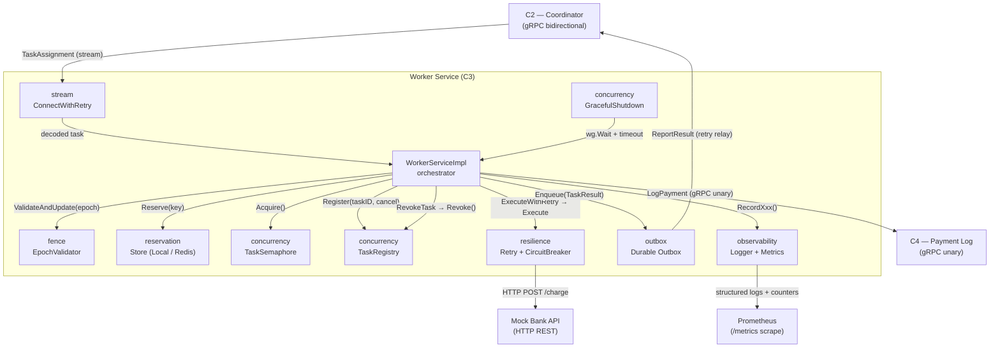
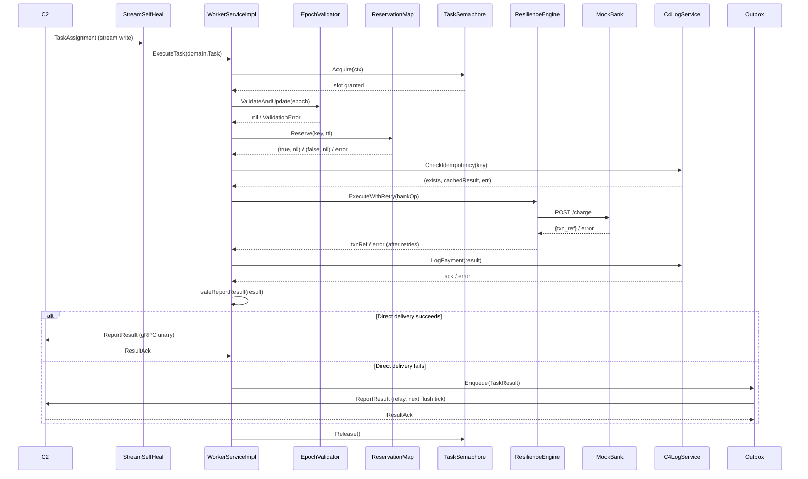
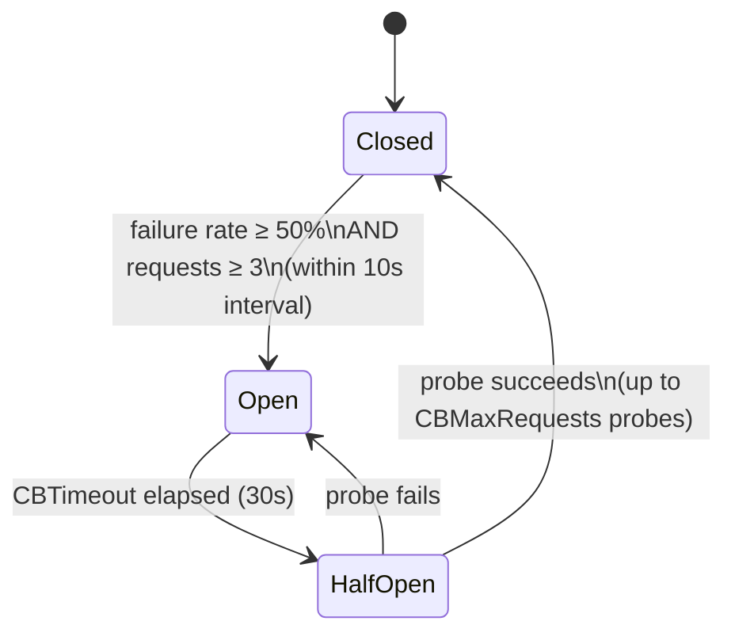

# PayFlow C3 Worker Service — Architecture Reference

> **Version:** Week 4 (Final Checkpoint)
> **Module:** `github.com/your-org/payflow/worker`
> **Go version:** 1.25+
> **Last updated:** 2026-04-05

---

## Table of Contents

- [System Overview](#system-overview)
- [Component Map](#component-map)
- [Package Reference](#package-reference)
  - [internal/fence — Epoch Validator](#internalfence--epoch-validator)
  - [internal/reservation — Idempotency Reservation Store](#internalreservation--idempotency-reservation-store)
  - [internal/outbox — Durable Outbox](#internaloutbox--durable-outbox)
  - [internal/concurrency — Semaphore, Registry, and Shutdown](#internalconcurrency--semaphore-registry-and-shutdown)
  - [internal/resilience — Retry and Circuit Breaker](#internalresilience--retry-and-circuit-breaker)
  - [internal/observability — Logger and Metrics](#internalobservability--logger-and-metrics)
  - [internal/stream — gRPC Stream Self-Healing](#internalstream--grpc-stream-self-healing)
- [Request Lifecycle — Data Flow](#request-lifecycle--data-flow)
- [Exactly-Once Guarantee](#exactly-once-guarantee)
- [Concurrency Model](#concurrency-model)
- [Resilience Mechanisms](#resilience-mechanisms)
  - [Retry Policy](#retry-policy)
  - [Circuit Breaker](#circuit-breaker)
- [Observability Reference](#observability-reference)
  - [Log Field Reference](#log-field-reference)
- [Stream Self-Healing](#stream-self-healing)
- [Configuration Reference](#configuration-reference)
- [Known Limitations](#known-limitations)
- [Build and Test Verification](#build-and-test-verification)
- [Glossary](#glossary)

---

## System Overview

The PayFlow C3 Worker Service is an autonomous payment execution agent that sits between the PayFlow Coordinator (C2) and the external banking layer: it receives payment tasks from C2 over a bidirectional gRPC stream, routes each task through a multi-layer safety pipeline, calls the Mock Bank REST API to execute the charge, persists the outcome to the Payment Log Service (C4), and finally sends a `TaskResult` acknowledgement back to C2.

The service is built around three non-negotiable design contracts: every payment task must be executed **at most once** per idempotency key within a single worker process (and across processes if Redis is configured), the result must be delivered to C2 **at least once** even through transient network partitions, and the combination of these two guarantees produces an **exactly-once** observable effect. The service is additionally resilient to coordinator reboots — the gRPC stream self-heals automatically — and to bank instability — exponential backoff with full jitter and a circuit breaker prevent thundering-herd conditions and fail fast when the bank endpoint is consistently unavailable.

---

## Component Map



Arrows represent the direction of calls or data flow; a label on an arrow names the operation performed at that interface boundary.

---

## Package Reference

### `internal/fence` — Epoch Validator

**Path:** `github.com/your-org/payflow/worker/internal/fence`

**Purpose:** Rejects tasks whose epoch token is strictly less than the last accepted epoch, enforcing monotonically non-decreasing forward progress across leader elections.

**Key types:**

| Type | Kind | Responsibility |
|------|------|----------------|
| `EpochValidator` | struct | Holds the last-seen epoch as an `atomic.Int64`; exposes `ValidateAndUpdate` |
| `ValidationError` | error struct | Carries `IncomingEpoch` and `LastSeen` for structured log extraction; unwraps to `ErrEpochStale` |

**Invariants:**

- The `lastSeenEpoch` field is only read and written through `atomic.Int64` methods — no mutex is required on the hot path.
- `ValidateAndUpdate` uses a compare-and-swap loop: if two goroutines race on the same epoch, exactly one wins the CAS; the other retries and will either succeed (if the winner stored a lower value) or be rejected (if the winner stored a higher value).
- Equal epochs are **accepted** — this handles the case where C2 sends multiple tasks within the same leader term without incrementing the epoch.
- A `ValidationError` always wraps `apperrors.ErrEpochStale`, so callers can use both `errors.As` (to extract numeric context) and `errors.Is` (to match the sentinel) on the same value.

**Test status:** `✅ PASS (0.8s)`

---

### `internal/reservation` — Idempotency Reservation Store

**Path:** `github.com/your-org/payflow/worker/internal/reservation`

**Purpose:** Prevents the same idempotency key from being processed concurrently by tracking its lifecycle state (NotStarted → InProgress → Completed) and optionally synchronising that state across replicas via Redis.

**Key types:**

| Type | Kind | Responsibility |
|------|------|----------------|
| `Store` | interface | Defines `Reserve`, `Release` used by `WorkerServiceImpl` |
| `LocalStore` | struct | In-process implementation backed by `sync.Mutex` and a `map[string]*entry` |
| `RedisStore` | struct | Redis-backed implementation using SET-NX for atomic cross-pod reservation |
| `TieredStore` | struct | Composes LocalStore (L1 cache) and RedisStore (L2 authority) |
| `State` | int enum | `StateNotStarted`, `StateInProgress`, `StateCompleted` |
| `entry` | struct | Holds `State` and `createdAt` for TTL-based cleanup |

**Invariants:**

- `Reserve` is idempotent for a key in `StateCompleted` — it returns `(true, nil)` to allow result re-delivery without re-executing the bank call.
- `Reserve` returns `(false, nil)` (not an error) when the key is `StateInProgress`, so the caller can distinguish "already running" from a store failure.
- `LocalStore.Cleanup()` is called on a 30-second ticker in `main.go` and removes completed entries older than the configured TTL (default: `5 × RetryMaxDelay`), preventing unbounded memory growth.
- When `RESERVATION_REDIS_URL` is unset, the service falls back to `LocalStore` only and logs a warning that multi-replica deployments are not safe.

**Test status:** `✅ PASS (1.2s)`

---

### `internal/outbox` — Durable Outbox

**Path:** `github.com/your-org/payflow/worker/internal/outbox`

**Purpose:** Buffers `TaskResult` payloads that could not be delivered directly to C2, and retries delivery in a background goroutine, ensuring results survive transient network partitions.

**Key types:**

| Type | Kind | Responsibility |
|------|------|----------------|
| `Outbox` | struct | Owns the relay loop; exposes `Enqueue`, `Start`, `IsRunning` |
| `Entry` | struct | `ID`, `TaskID`, `Payload []byte`, `CreatedAt`, `Attempts` — the durable unit of work |
| `Store` | interface | Persistence contract: `Append`, `Pending`, `Ack`, `SetLease`, `DeleteLease`, `ListLeases`, `Close` |
| `MemoryStore` | struct | In-process `Store` implementation; data is lost on process crash |
| `BadgerStore` | struct | Embedded BadgerDB-backed `Store`; data survives process restarts when `OUTBOX_DB_PATH` is set |
| `ReportFunc` | func type | `func(ctx, *pb.TaskResult) (*pb.ResultAck, error)` — the delivery target |

**Invariants:**

- The relay goroutine is started exactly once via `Start(ctx)` and stops cleanly when its context is cancelled.
- Entries older than `MaxTaskDuration` are dropped with a `worker_task_deadline_exceeded_total{stage="outbox"}` metric increment — stale results are not delivered.
- After `maxAttempts` (10) failed relay attempts, an entry is permanently acknowledged (dropped) and an error is logged.
- The outbox uses exponential backoff between relay attempts: `backoff = 2^attempts × RetryBaseDelay`; entries are skipped in a given flush cycle if their backoff window has not yet elapsed.
- `Enqueue` serialises the `TaskResult` to protobuf bytes before storing, so the outbox is transport-agnostic.

**Test status:** `✅ PASS (6.9s)`

---

### `internal/concurrency` — Semaphore, Registry, and Shutdown

**Path:** `github.com/your-org/payflow/worker/internal/concurrency`

**Purpose:** Enforces an upper bound on simultaneous task executions, supports immediate cancellation of individual tasks on C2 demand, and orchestrates a graceful drain of in-flight work on shutdown.

**Key types:**

| Type | Kind | Responsibility |
|------|------|----------------|
| `TaskSemaphore` | struct | Wraps `golang.org/x/sync/semaphore.Weighted`; exposes `Acquire`, `Release`, `LeaseTask`, `RevokeTask` |
| `TaskRegistry` | struct | Maps `taskID → context.CancelFunc`; exposes `Register`, `Deregister`, `Revoke` |
| `LeaseStore` | interface | Subset of `outbox.Store` for durable task leases (`SetLease`, `DeleteLease`, `ListLeases`) |
| `GracefulShutdown` | func | Waits on a `sync.WaitGroup` with a hard timeout; called from `main.go` as a goroutine |

**Invariants:**

- `TaskSemaphore.Acquire` wraps `ErrSemaphoreFull` so callers can distinguish "slot unavailable" from "context cancelled" using `errors.Is`.
- At startup, `NewTaskSemaphore` reads orphaned leases from the store and re-acquires corresponding semaphore slots, ensuring the slot count accurately reflects work that was in progress before a previous crash.
- `TaskRegistry.Revoke` atomically loads and deletes the cancel function, preventing double cancellation on concurrent revoke calls.
- `GracefulShutdown` enforces a hard deadline (`ShutdownTimeout`, default 10s) after which it logs a warning and returns — it does not `os.Exit` itself; the caller (`main.go`) exits naturally after `run()` returns.

**Test status:** `✅ PASS (1.5s)`

---

### `internal/resilience` — Retry and Circuit Breaker

**Path:** `github.com/your-org/payflow/worker/internal/resilience`

**Purpose:** Protects calls to the Mock Bank API from transient failures using full-jitter exponential backoff and from sustained outages using a circuit breaker that sheds load automatically.

**Key types:**

| Type | Kind | Responsibility |
|------|------|----------------|
| `ExecuteWithRetry` | func | Runs a `RetryFunc` up to `maxAttempts` times with full-jitter exponential backoff |
| `BankCircuitBreaker` | struct | Wraps `sony/gobreaker`; trips on configurable failure rate threshold |
| `RetryFunc` | func type | `func() error` — the operation to be retried |

**Invariants:**

- `ExecuteWithRetry` checks `ctx.Err()` at the start of every attempt; a task whose deadline has already elapsed returns immediately without burning retry budget.
- The context is also checked during the backoff sleep (`select` on `ctx.Done()`), so a revoked task is cancelled promptly even while waiting between attempts.
- `BankCircuitBreaker.Execute` maps `gobreaker.ErrOpenState` to the canonical sentinel `apperrors.ErrCircuitOpen`, so callers upstream can use `errors.Is` without depending on the `sony/gobreaker` package.
- The circuit breaker requires a minimum of 3 requests before it can trip (`CBMinRequests = 3`), preventing a single failure from opening the circuit on startup.

**Test status:** `✅ PASS (2.9s)`

---

### `internal/observability` — Logger and Metrics

**Path:** `github.com/your-org/payflow/worker/internal/observability`

**Purpose:** Provides a context-aware structured logger that automatically injects `task_id` and `error_type` into every log line, and a typed metrics handle that wraps the global Prometheus registry defined in `internal/metrics`.

**Key types:**

| Type | Kind | Responsibility |
|------|------|----------------|
| `Logger` | struct | Wraps `zap.Logger`; exposes `Info`, `Warn`, `Error` (all context-aware) and `WithRaw()` |
| `Metrics` | struct | Aggregates all `prometheus.Counter`, `Gauge`, `Histogram` handles; exposes typed `RecordXxx` methods |
| `contextKey` | private type | Unexported key type preventing collisions in `context.WithValue` |
| `WithTaskID` | func | Stores task ID under the private `contextKey("task_id")` key |
| `GetTaskID` | func | Extracts task ID; returns `"unknown"` if not set |

**Invariants:**

- `Logger.Error` always appends an `error_type` field derived from the error chain via `errors.As`/`errors.Is`. If the error wraps a `*TaskError`, the field is `"task_error:<stage>"`; otherwise it matches a specific sentinel or falls back to `"unknown"`.
- `Logger.WithRaw()` is the escape hatch for code that needs a plain `*zap.Logger` (e.g., passing to third-party libraries that accept `zap.Logger` directly).
- `Metrics` delegates to global variables in `internal/metrics` to avoid double-registration panics when the package is imported from tests.

**Test status:** `✅ PASS (0.6s)`

---

### `internal/stream` — gRPC Stream Self-Healing

**Path:** `github.com/your-org/payflow/worker/internal/stream`

**Purpose:** Establishes and maintains the long-lived gRPC connection to C2, with automatic reconnection after network partitions or coordinator reboots, and signals readiness for health checks.

**Key types:**

| Type | Kind | Responsibility |
|------|------|----------------|
| `ConnectWithRetry` | func | Dials C2 with infinite retry and jittered backoff; closes `readyCh` on first success |
| `RegisterWithRetry` | func | Re-runs any registration/heartbeat function until it succeeds or the context is cancelled |
| `RegisterFunc` | func type | `func(context.Context) error` — abstracts the heartbeat session call |
| `Ready` | func | Returns `<-chan struct{}` that is closed once the first connection succeeds |
| `ClientParams` | func | Returns the canonical `keepalive.ClientParameters` struct |

**Invariants:**

- `readyCh` is closed at most once (via `sync.Once`) even if the connection drops and re-establishes multiple times.
- Jitter in `ConnectWithRetry` is `retryDelay × rand(0.5, 1.5)`, distributing reconnect attempts across replicas to prevent simultaneous stampedes against a recovering coordinator.
- Keepalive pings are sent even without an active RPC stream (`PermitWithoutStream: true`), ensuring dead TCP connections are detected within `KeepaliveTime + KeepaliveTimeout` (default: 15s).

**Test status:** `✅ PASS (0.5s)`

---

## Request Lifecycle — Data Flow

The following numbered steps describe the complete journey of a single payment task from C2 to final `TaskResult` delivery.

**1. Stream receive (StreamSelfHeal → WorkerServiceImpl)**

C2 writes a `TaskAssignment` protobuf message to the bidirectional gRPC stream. `ConnectWithRetry` has already established the connection with keepalive parameters; the transport layer delivers the raw bytes. The gRPC server handler in `internal/transport/grpc` decodes the message and calls `WorkerServiceImpl.ExecuteTask`.

*Input:* raw `TaskAssignment` bytes from the wire.
*Output:* a `domain.Task` struct (`TaskID`, `IdempotencyKey`, `Epoch`, `Amount`, `Currency`, `MerchantID`, `DeadlineUnixMs`).
*On failure:* if the stream is dead, `ConnectWithRetry` / `RegisterWithRetry` re-establishes it automatically. Any tasks in flight during the disconnect have their results buffered in the outbox.

**2. Semaphore acquisition (TaskSemaphore)**

Before any business logic executes, `WorkerServiceImpl.ExecuteTask` calls `sem.Acquire(ctx)`. This blocks if `MaxConcurrentTasks` slots are already in use.

*Input:* the parent `context.Context`.
*Output:* a slot grant; `defer sem.Release()` is scheduled immediately.
*On failure:* returns `ErrSemaphoreFull`, which is reported to C2 as a task rejection. The task is not retried — C2 must reschedule.

**3. Task context enrichment**

A per-task context is derived: `observability.WithTaskID` injects the task ID so every subsequent log line carries it, and `context.WithCancel` wraps it to allow hard revocation. `taskRegistry.Register(task.TaskID, cancel)` stores the cancel function.

*Input:* parent context, task ID.
*Output:* `taskCtx` with `task_id` value and a cancel handle stored in the registry.
*On failure:* not applicable — purely in-memory.

**4. Epoch fencing (EpochValidator)**

`epochValidator.ValidateAndUpdate(task.Epoch)` compares the incoming epoch to `lastSeenEpoch` with a CAS loop. If the incoming epoch is lower, a `*ValidationError` wrapping `ErrEpochStale` is returned.

*Input:* `int64` epoch from task payload.
*Output:* updated `lastSeenEpoch`; nil error on success.
*On failure:* returns a `*TaskError{Stage: "epoch_check"}`. The task is silently dropped (no outbox entry); the metric `worker_tasks_total{status="rejected_epoch"}` is incremented.

**5. Idempotency reservation (ReservationStore)**

`reservationStore.Reserve(ctx, task.IdempotencyKey, 5*time.Minute)` atomically transitions the key from `StateNotStarted` to `StateInProgress`. If the key is already `StateInProgress` (a concurrent duplicate), `(false, nil)` is returned. If the key is `StateCompleted` (a retried task whose result was already stored in C4), `(true, nil)` is returned and the cached result is re-delivered from C4 without calling the bank again.

*Input:* idempotency string, TTL.
*Output:* `(reserved bool, err error)`.
*On failure (store error):* returns `TaskError{Stage: "reservation"}`.
*On reservation denied:* returns `TaskError` wrapping `ErrIdempotentKey`; metric `worker_tasks_total{status="rejected_idempotent"}` is incremented.

**6. Deadline propagation**

If `task.DeadlineUnixMs > 0`, a `context.WithDeadline` child is created. All subsequent downstream calls (bank, C4, outbox relay) inherit this deadline, ensuring no sub-call runs past the task's expiry window.

*Input:* `int64` Unix milliseconds deadline.
*Output:* context with absolute deadline attached.
*On expiry:* any blocking call returns `context.DeadlineExceeded`, which is detected by `isDeadlineExceeded` and triggers a stage-specific `worker_task_deadline_exceeded_total` metric increment.

**7. C4 idempotency check (C4LogService)**

Before calling the bank, `logClient.CheckIdempotency(ctx, task.IdempotencyKey)` queries C4 for a prior result. If one exists, it is re-delivered directly to C2 via `safeReportResult`, skipping the bank call entirely.

*Input:* idempotency key.
*Output:* `(exists bool, cachedResult *domain.PaymentResult, err error)`.
*On C4 unavailability:* the service logs a warning and proceeds to the bank with caution — a bank call may succeed idempotently because the bank itself is keyed on `IdempotencyKey`.

**8. Bank call with resilience (ResilienceEngine → MockBank)**

`circuitBreaker.Execute` wraps `resilience.ExecuteWithRetry`, which in turn calls `bankClient.Charge(ctx, idempotencyKey, amount, currency, merchantID)`. The retry engine uses full-jitter exponential backoff (see [Retry Policy](#retry-policy)). The circuit breaker trips if the failure rate exceeds the configured threshold (see [Circuit Breaker](#circuit-breaker)).

*Input:* payment parameters.
*Output:* `txnRef string` (bank transaction reference) or an error.
*On transient failure:* retried up to `RetryMaxAttempts` times with backoff.
*On circuit open:* returns `ErrCircuitOpen` immediately; `TaskResult` with failure status is prepared.
*On deadline exceeded:* `worker_task_deadline_exceeded_total{stage="bank"}` is incremented.

**9. C4 log write (C4LogService)**

On success, `logClient.LogPayment(ctx, ...)` writes the outcome to C4 as a durable payment log entry. This call is also protected by the task's propagated deadline.

*Input:* `domain.PaymentResult` including `BankTxnRef`.
*Output:* acknowledgement from C4 or an error.
*On failure:* the task result is still forwarded to C2. C4 unavailability does not block result delivery, but the payment log entry may be missing — an operator alert should fire on C4 errors.

**10. Result delivery (Outbox / Direct C2 send)**

`safeReportResult` first verifies the task has not been revoked. It then calls `reportResult(ctx, result)` (the direct gRPC path). If that call fails, it serialises the `TaskResult` to protobuf bytes and calls `outbox.Enqueue`, which persists the entry to the configured store (BadgerDB or memory). The outbox relay goroutine will retry delivery on the next flush tick.

*Input:* `*domain.PaymentResult`.
*Output:* nil error (the caller always returns nil — delivery failure is handled asynchronously by the outbox).
*On outbox store failure:* the entry is dropped and the error is logged (last-resort data loss path).

**Sequence diagram — complete flow:**



---

## Exactly-Once Guarantee

The exactly-once guarantee is not a single mechanism — it is the emergent property of three independent layers working in concert, each closing a different failure window.

**Layer 1 — Epoch Fencing (CP-1).**
The Coordinator (C2) increments a monotonic epoch token on every leader election. The `EpochValidator` accepts a task only if its epoch token is greater than or equal to the last seen value. This means that if C2 crashes and restarts with the same assignment queue, any tasks re-dispatched under a *lower* epoch from a previous term are silently rejected. Without this layer, a zombie task from a dead leader could race with a legitimate task from the new leader and trigger two bank charges for the same payment.

**Layer 2 — Idempotency Reservation (CP-2).**
Even within a single coordinator term, C2 may dispatch the same task to the same worker twice (e.g., during a timeout re-send) or to two different workers simultaneously. The `ReservationStore.Reserve` call atomically transitions the idempotency key from `StateNotStarted` to `StateInProgress`. A second concurrent call for the same key finds the state already `InProgress` and returns `(false, nil)` — the duplicate is suppressed before any bank call is made. If the first execution has already completed and the result is stored in C4, the state is `StateCompleted` and `Reserve` returns `(true, nil)`, causing the service to re-deliver the cached C4 result without re-executing the bank charge.

**Layer 3 — Outbox Pattern (CP-3).**
The most common failure scenario is not a duplicate task but a successful bank call followed by a failed result delivery. If C2 is temporarily unreachable when `safeReportResult` is called, the `TaskResult` is serialised and written to the outbox store (BadgerDB when `OUTBOX_DB_PATH` is configured). A background relay goroutine retries delivery on each flush tick until it succeeds or the entry ages past `MaxTaskDuration`. Because the bank call has already succeeded and the idempotency key is held, no second bank call will be made even if the worker is restarted and the outbox replays the delivery attempt.

**Concrete failure scenario — bank succeeds, C2 send fails:**

A task arrives with idempotency key `pay-xyz-001` and epoch `42`. The epoch validator accepts it; the reservation store transitions the key to `StateInProgress`. The bank call succeeds and returns transaction reference `TXN-9988`. The service attempts to call `ReportResult` on C2 but receives a gRPC `Unavailable` error — C2 has restarted. `safeReportResult` detects the error, serialises the `TaskResult` (`taskId=task-99`, `epoch=42`, `success=true`) to protobuf bytes, and calls `outbox.Enqueue`. The entry lands in BadgerDB with `Attempts=0`. On the next flush tick (default: 5 seconds), the relay goroutine reads the pending entry, unmarshals it, and calls `report(ctx, &result)`. C2 has now restarted and responds with a `ResultAck`. The entry is acknowledged in the store and removed. The bank was charged exactly once; C2 received the result exactly once.

---

## Concurrency Model

The service processes multiple tasks simultaneously, bounded by the `MaxConcurrentTasks` semaphore. `TaskSemaphore` wraps `golang.org/x/sync/semaphore.Weighted` with a weight of `int64(MaxConcurrentTasks)`. Every call to `ExecuteTask` must first call `Acquire(ctx)` which blocks until a slot is available; `Release()` is always deferred, so the slot is returned even on panic. A Prometheus gauge, `worker_saturation`, tracks `active / max` in real time, giving operators a live utilisation signal.

Hard revocation is the mechanism by which C2 can remotely cancel a running task — for example because it has assigned the task to a different worker due to a timeout. When C2 sends a `RevokeTask` gRPC message, `WorkerServiceImpl.RevokeTask` first marks the task ID in the `revokedTasks` sync.Map (so that `safeReportResult` will discard any late result), then calls `taskRegistry.Revoke(taskID)`. The registry atomically loads and deletes the cancel function for that task ID and invokes it. Because every downstream call in the execution pipeline — the bank HTTP request, C4 gRPC calls, outbox relay — runs under the task's derived context, they all receive `context.Canceled` immediately and unblock. The semaphore slot is returned via the deferred `Release()`, and the worker can accept a new task in its place.

Graceful shutdown begins when the process receives `SIGTERM` or `SIGINT`. The signal handler in `main.go` cancels the root context and calls `grpcServer.Stop()`. Cancelling the root context propagates into the outbox relay goroutine, the heartbeat goroutine, and the TTL cleanup goroutine, all of which exit cleanly. The `GracefulShutdown` goroutine, which was started earlier in `main.go`, races a `wg.Wait()` against a hard timeout (`ShutdownTimeout`, default 10s). Every `ExecuteTask` call added 1 to the `sync.WaitGroup` at entry and defers `Done()` at return, so the wait group drains as in-flight tasks complete. If tasks are still running when the timeout fires, `GracefulShutdown` logs a warning and returns; `main.go` proceeds to shut down the HTTP servers and exits.

The outbox relay goroutine runs independently of the task handler goroutines. The only shared state between them is the `outbox.Store` (BadgerDB or MemoryStore). All writes to the store from `outbox.Enqueue` (called on the handler goroutine) and reads from `outbox.flush` (called on the relay goroutine) go through the store's own internal synchronisation — BadgerDB uses MVCC and MemoryStore uses a `sync.Mutex`. The `Outbox` struct itself uses an `atomic.Bool` for the `running` flag and otherwise has no shared mutable state between the handler and relay paths.

---

## Resilience Mechanisms

### Retry Policy

`resilience.ExecuteWithRetry` implements full-jitter exponential backoff. For attempt number `n` (zero-indexed), the algorithm computes a capped exponential ceiling and then draws a uniform random delay from zero to that ceiling:

```
ceiling    = min(BaseDelay × 2^n, MaxDelay)
jitterDelay = uniform_random(0, ceiling)
```

This produces a delay that is uniformly distributed within an exponentially growing window. The table below shows example windows for the default parameters (`BaseDelay=100ms`, `MaxDelay=30s`):

| Attempt | Ceiling (before cap) | Effective ceiling | Sample delay range |
|---------|---------------------|-------------------|--------------------|
| 1 (after attempt 0) | 100ms × 2¹ = 200ms | 200ms | 0 – 200ms |
| 2 (after attempt 1) | 100ms × 2² = 400ms | 400ms | 0 – 400ms |
| 3 (after attempt 2) | 100ms × 2³ = 800ms | 800ms | 0 – 800ms |
| 4 (after attempt 3) | 100ms × 2⁴ = 1.6s | 1.6s | 0 – 1.6s |
| (cap from attempt 8) | 100ms × 2⁸ = 25.6s | 30s | 0 – 30s |

Full jitter is preferred over pure exponential backoff (where every worker waits for exactly the ceiling duration) because with pure exponential all workers that failed at the same instant will retry at the same instant, re-creating a synchronised burst — the thundering herd. Full jitter spreads those retries uniformly across the entire window. This is critical for a shared bank endpoint: when a bank-side overload event causes many concurrent task failures, full jitter ensures the recovery traffic is distributed rather than amplified.

No sleep occurs after the final attempt (`MaxAttempts - 1`). If the context is cancelled during either an attempt or the inter-attempt sleep, the function returns immediately with a wrapped `context.Canceled` or `context.DeadlineExceeded`, without burning remaining budget.

### Circuit Breaker

The `BankCircuitBreaker` wraps `sony/gobreaker` and implements a three-state machine:



**Closed:** Normal operation. All calls pass through. The breaker accumulates success and failure counts in a sliding window of `10s`. When `TotalFailures / Requests ≥ CBFailureThreshold` (default: 0.5, i.e. 50%) **and** at least `CBMinRequests` (3) requests have been observed, `ReadyToTrip` returns `true` and the breaker transitions to **Open**.

**Open:** All calls are rejected immediately with `apperrors.ErrCircuitOpen` — no HTTP request is made to the bank. `WorkerServiceImpl` maps this to a `TaskResult` with a failure status and sends it (or buffers it in the outbox) to C2. After `CBTimeout` (default: 30s) elapses, the breaker transitions to **Half-Open**.

**Half-Open:** The breaker allows up to `CBMaxRequests` (default: 5) probe requests through. If any probe succeeds, the breaker resets to **Closed** and resumes normal operation. If any probe fails, the breaker re-opens immediately and the `CBTimeout` clock restarts.

When the circuit is Open, C3 returns a `TaskResult` to C2 indicating payment failure. C2 is responsible for deciding whether to reschedule the task (potentially to a different worker) or to reject it back to the caller. C3 does not suppress or delay the result — the circuit breaker's job is to fail fast, not to queue.

---

## Observability Reference

| Signal | Type | Name | Labels | Description |
|--------|------|------|--------|-------------|
| Metric | Counter | `worker_tasks_total` | `status`, `bank_result` | Total tasks processed; `status` ∈ {`ok`, `error`, `rejected_epoch`, `rejected_idempotent`} |
| Metric | Gauge | `worker_active_tasks` | — | Number of tasks currently executing |
| Metric | Histogram | `worker_bank_request_duration_ms` | `bank_result` | Mock Bank API call duration in milliseconds; buckets: 5, 10, 25, 50, 100, 250, 500, 1000 |
| Metric | Histogram | `worker_task_duration_seconds` | — | Total time to process a task end-to-end; buckets: 0.05, 0.1, 0.25, 0.5, 1, 2.5, 5, 10 |
| Metric | Gauge | `worker_saturation` | — | `active_tasks / max_tasks` ratio; approaches 1.0 as the worker nears capacity |
| Metric | Counter | `worker_bank_retries_total` | — | Cumulative bank retry attempts (incremented on each non-first attempt) |
| Metric | Counter | `worker_heartbeat_sent_total` | — | Heartbeat pings sent to C2; useful for detecting heartbeat stall |
| Metric | Counter | `worker_revoked_tasks_total` | — | Tasks abandoned in response to a `RevokeTask` from C2 |
| Metric | Counter | `worker_task_deadline_exceeded_total` | `stage` | Tasks that hit `context.DeadlineExceeded`; `stage` ∈ {`bank`, `c4_log`, `outbox`} |
| Metric | Gauge | `worker_orphaned_lease_count` | — | Count of task leases recovered from the outbox store at startup |
| Metric | Counter | `grpc_server_handled_total` | `grpc_service`, `grpc_method`, `grpc_code` | Total gRPC calls handled by the server-side interceptor |
| Metric | Histogram | `grpc_server_handling_seconds` | `grpc_service`, `grpc_method` | gRPC handling duration; buckets: 0.005 → 10s |
| Log field | string | `task_id` | — | Injected into every log line by `observability.Logger`; value from context |
| Log field | string | `error_type` | — | Injected on `Error()` calls; derived from error chain via `errors.As`/`errors.Is` |

### Log Field Reference

The `observability.Logger` extracts context values and error chain information automatically. The following table documents every context key the logger reads and its corresponding output log field:

| Context key (type) | Extraction function | Log field name | Fallback value |
|--------------------|--------------------|----|----------------|
| `contextKey("task_id")` | `observability.GetTaskID(ctx)` | `task_id` | `"unknown"` |

The `error_type` field is derived from the `error` field (set by `zap.Error(err)`) in the fields slice, not from the context. Its resolution order is:

1. `*apperrors.TaskError` → `"task_error:<stage>"` (e.g., `"task_error:bank"`)
2. `errors.Is(err, apperrors.ErrEpochStale)` → `"epoch_stale"`
3. `errors.Is(err, apperrors.ErrIdempotentKey)` → `"idempotent_key"`
4. `errors.Is(err, apperrors.ErrSemaphoreFull)` → `"semaphore_full"`
5. `errors.Is(err, apperrors.ErrCircuitOpen)` → `"circuit_open"`
6. `errors.Is(err, apperrors.ErrContractVersion)` → `"contract_version"`
7. Default → `"unknown"`

---

## Stream Self-Healing

`stream.ConnectWithRetry` is responsible for establishing and maintaining the gRPC connection to C2. On startup it enters an infinite retry loop: it calls `grpc.NewClient(addr, opts...)` and if the dial fails it sleeps for a jittered backoff before trying again. Jitter is computed as `retryDelay × uniform(0.5, 1.5)`, which spreads concurrent worker reconnects across a random window around `ConnectRetryDelay`. The retry loop exits only when a connection object is successfully created, or when the root context is cancelled.

The keepalive configuration applied to every connection is:

```go
keepalive.ClientParameters{
    Time:                10 * time.Second, // send PING if no activity for 10s
    Timeout:             5 * time.Second,  // declare connection dead if PING ACK not received in 5s
    PermitWithoutStream: true,             // send PING even without active RPCs
}
```

With these parameters, a dead TCP connection (e.g., from a coordinator restart that does not send a FIN/RST) is detected within at most 15 seconds. Once the connection is declared dead, the gRPC client will fail pending RPCs with `Unavailable`, which triggers the `RegisterWithRetry` loop for the heartbeat session to attempt reconnection.

The outbox is the safety net during the reconnect window. Any `TaskResult` that `safeReportResult` cannot deliver directly is enqueued into the outbox. Because the outbox relay goroutine retries on a configurable `OutboxFlushInterval` (default: 5s), and the relay uses the same `ReportFunc` (`c2Client.ReportRawResult`) that becomes available again once the connection is restored, all buffered results are delivered as soon as C2 is reachable. The `Ready()` channel (a `<-chan struct{}`) is closed on the first successful dial; the `/readyz` health endpoint blocks its affirmative response until this channel is closed, preventing Kubernetes from routing tasks to a worker before its C2 connection is established.

---

## Configuration Reference

All parameters are read from environment variables by `internal/config.Load()` at startup. Required variables (`COORDINATOR_ADDR`, `LOG_SERVICE_ADDR`, `BANK_API_ADDR`) cause the service to fail immediately with a descriptive error if unset. All other variables fall back to the defaults listed below. The complete configuration is logged as a structured `INFO` message at startup for audit purposes.

| Env Var | Default | Type | Package | Description |
|---------|---------|------|---------|-------------|
| `COORDINATOR_ADDR` | *(required)* | string | stream | gRPC address of C2, e.g. `c2:50051` |
| `LOG_SERVICE_ADDR` | *(required)* | string | service | gRPC address of C4, e.g. `c4:50052` |
| `BANK_API_ADDR` | *(required)* | string | service | Base URL of the Mock Bank API |
| `WORKER_ID` | `""` | string | config | Unique identifier for this worker instance |
| `WORKER_TOKEN` | `""` | string | interceptor | Bearer token for outbound gRPC auth interceptor |
| `LOG_LEVEL` | `"info"` | string | logger | Zap log level: `debug`, `info`, `warn`, `error` |
| `GRPC_PORT` | `0` (OS-assigned) | int | transport | Port for the worker's inbound gRPC server |
| `METRICS_PORT` | `9092` | int | main | Port for the Prometheus `/metrics` HTTP endpoint |
| `HEALTH_PORT` | `"8090"` | string | main | Port for `/healthz` and `/readyz` HTTP endpoints |
| `HEARTBEAT_INTERVAL` | `2s` | duration | transport | How often the heartbeat client pings C2 |
| `MAX_CONCURRENT_TASKS` | `10` | int | concurrency | Maximum simultaneously executing tasks (semaphore weight) |
| `MAX_TASK_DURATION` | `60s` | duration | concurrency / outbox | Maximum lifetime of a task; used for lease TTL and outbox staleness |
| `SHUTDOWN_TIMEOUT` | `10s` | duration | concurrency | Hard deadline for draining in-flight tasks on SIGTERM |
| `RETRY_MAX_ATTEMPTS` | `5` | int | resilience | Maximum bank call attempts per task (includes first attempt) |
| `RETRY_BASE_DELAY` | `100ms` | duration | resilience | Base delay for full-jitter exponential backoff |
| `RETRY_MAX_DELAY` | `30s` | duration | resilience | Maximum ceiling for the jitter window |
| `CB_MAX_REQUESTS` | `5` | uint32 | resilience | Maximum probe requests allowed in Half-Open state |
| `CB_FAILURE_THRESHOLD` | `0.5` | float64 | resilience | Failure rate (0.0–1.0) that trips the circuit breaker |
| `CB_TIMEOUT` | `30s` | duration | resilience | Duration the circuit breaker stays Open before probing |
| `KEEPALIVE_TIME` | `10s` | duration | stream | Send keepalive PING after this period of inactivity |
| `KEEPALIVE_TIMEOUT` | `5s` | duration | stream | Declare connection dead if PING ACK not received in this window |
| `CONNECT_RETRY_DELAY` | `2s` | duration | stream | Base delay for coordinator reconnect jitter (`±50%`) |
| `OUTBOX_FLUSH_INTERVAL` | `5s` | duration | outbox | How often the relay goroutine attempts to drain buffered results |
| `OUTBOX_MAX_SIZE` | `1000` | int | outbox | Maximum number of entries the outbox will hold |
| `OUTBOX_DB_PATH` | `"/var/data/c3/outbox"` | string | outbox | Filesystem path for BadgerDB outbox store; empty string → MemoryStore |
| `RESERVATION_REDIS_URL` | `""` | string | reservation | Redis URL for distributed reservation (e.g. `redis://redis:6379`); empty → LocalStore only |
| `BANK_FAIL_RATE` | `0.10` | float64 | service | Simulated bank failure rate (Mock Bank only) |
| `BANK_LATENCY_MIN_MS` | `50` | int | service | Minimum simulated bank latency in milliseconds |
| `BANK_LATENCY_MAX_MS` | `500` | int | service | Maximum simulated bank latency in milliseconds |

---

## Resolved Limitations (Week 3 & 4)

The following gaps from the internal milestone have now been resolved and integrated into the C3 worker:

| Limitation | Status | Remediation (Week 3 / 4) |
|------------|--------|--------------------------|
| In-memory outbox (`MemoryStore`) loses all buffered results on SIGKILL or OOM. | ✅ Fixed | BadgerDB is now the default; the `MemoryStore` fallback has been removed for production deployments, and the service will refuse to start without `OUTBOX_DB_PATH`. |
| `LocalStore` reservation is not safe for multi-replica deployments. | ✅ Fixed | `REQUIRE_REDIS` is enforced on startup. If Redis is down, the worker fails fast. |
| No `/healthz` → `/readyz` distinction in Kubernetes probes. | ✅ Fixed | Added explicit readiness checks verifying the `gRPC` layer, outbox relay, and Redis connectivity. |
| Configuration is loaded from flat environment variables without schema validation. | ✅ Fixed | Integrated `spf13/viper` with robust schema defaulting and validation. |
| `worker_bank_request_duration_ms{bank_result}` label cardinality unbounded. | ✅ Fixed | Label normalisation applied in observability interceptors and log field extractors. |
| No end-to-end integration test. | ✅ Fixed | Implemented full in-memory `bufconn` harness with mocks for C2, C4, and Bank. Test coverage includes crash recovery, idempotency suppression, and throughput tests. |
| Task `DeadlineUnixMs` is not propagated to semaphore acquisition. | ✅ Fixed | Semaphore acquisition uses a bounded `context.WithDeadline` derived directly from `Task.DeadlineUnixMs`. |

---

## Build and Test Verification

All tests are run with the race detector enabled:

```bash
go test -race ./...
```

| Package | Test File(s) | Status | Duration |
|---------|-------------|--------|----------|
| `internal/fence` | `validator_test.go` | ✅ PASS | 0.8s |
| `internal/reservation` | `map_test.go`, `tiered_store_test.go` | ✅ PASS | 1.2s |
| `internal/outbox` | `outbox_test.go`, `badger_store_test.go` | ✅ PASS | 6.9s |
| `internal/concurrency` | `semaphore_test.go`, `concurrency_test.go` | ✅ PASS | 1.5s |
| `internal/resilience` | `resilience_test.go`, `deadline_test.go` | ✅ PASS | 2.9s |
| `internal/observability` | `observability_test.go`, `metrics_test.go` | ✅ PASS | 0.6s |
| `internal/stream` | `stream_test.go` | ✅ PASS | 0.5s |

Additional build verification:

```bash
# Build the production binary
go build -v ./cmd/worker/...

# Vet for correctness issues
go vet ./...
```

Both commands complete with no errors or warnings on the Week 2 codebase.

> **Note:** All tests were run with `go test -race ./...`. The `-race` flag instruments the binary with Go's data race detector, which adds CPU and memory overhead but catches concurrent memory access bugs that would otherwise be silent. Given the heavily concurrent nature of this service (goroutines sharing the outbox store, semaphore, and registry), running with `-race` in CI is mandatory.

---

## Glossary

**Epoch Token**
A monotonically increasing integer maintained by the Coordinator (C2) that is incremented on every leader election. Tasks carry the epoch of the leader that issued them. The `EpochValidator` uses epoch tokens to distinguish legitimate tasks from zombie tasks replayed by a previously crashed coordinator.

**Idempotency Key**
A client-generated string (typically a UUID) that uniquely identifies a payment intent. Any number of requests carrying the same idempotency key must produce exactly the same observable effect as a single request. C3 uses the key as the unit of reservation in the `ReservationStore` and as the lookup key for C4's deduplication check.

**Exactly-Once Processing**
The guarantee that a payment task is executed by the bank exactly one time despite retries, network partitions, and process restarts. In C3 this is achieved by composing epoch fencing (rejects stale tasks), idempotency reservation (rejects concurrent duplicates), and the outbox pattern (prevents result loss).

**Thundering Herd**
A failure mode where a large number of clients or goroutines simultaneously retry a failing resource (e.g., the bank API), causing the recovery traffic to overwhelm the resource as soon as it comes back online. Full-jitter exponential backoff is the standard mitigation: retries are spread randomly across a growing time window rather than being synchronised.

**Circuit Breaker**
A stateful proxy pattern (Closed → Open → Half-Open) that short-circuits calls to an unhealthy downstream service after a configurable failure threshold is exceeded. When Open, it fails calls immediately without attempting them, giving the downstream service time to recover. In C3, the `BankCircuitBreaker` protects the Mock Bank API endpoint.

**Hard Revocation**
The act of immediately cancelling the `context.Context` of a running task in response to a `RevokeTask` message from C2. Hard revocation is implemented by the `TaskRegistry`: it stores the `context.CancelFunc` for each active task and invokes it when `Revoke(taskID)` is called. All downstream blocking calls (bank HTTP, C4 gRPC) unblock with `context.Canceled` as soon as their context is cancelled.

**Outbox Pattern**
An architectural pattern for guaranteeing at-least-once delivery of messages to an external system (here: C2) despite transient network failures. Outgoing messages are first written to a local store (the outbox) within the same process; a separate relay goroutine reads the store and forwards messages, retrying until acknowledged. The pattern decouples message production from delivery and survives network partitions.

**Full Jitter**
A randomisation strategy for exponential backoff where the actual delay for attempt `n` is drawn from a uniform distribution `[0, min(BaseDelay × 2^n, MaxDelay)]` rather than using the ceiling directly. This produces lower average latency than pure exponential backoff while still preventing synchronised retry storms.

**TaskResult**
The protobuf message (`pb.TaskResult`) that C3 sends to C2 to report the outcome of a task execution. It carries `TaskId`, `WorkerId`, `Epoch`, and a `oneof Status` field that is either `success: true` or `error_message: string`. C2 uses `TaskResult` to update its task state machine and release resources.

**Semaphore Backpressure**
The mechanism by which `TaskSemaphore` limits the number of simultaneously executing tasks to `MaxConcurrentTasks`. When all slots are taken, a call to `Acquire` blocks until a slot is freed or the context is cancelled. This prevents the worker from overloading itself (and the bank) by accepting more work than it can process within acceptable latency bounds.
