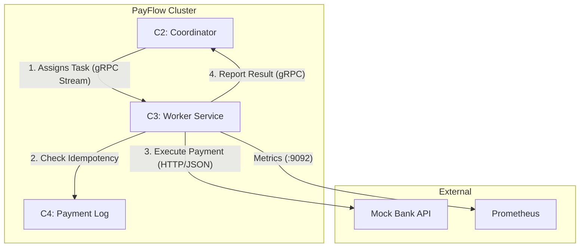
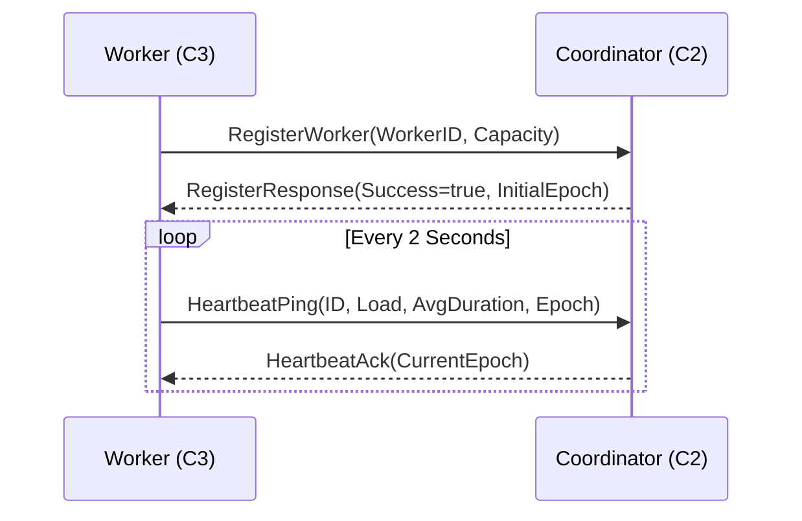
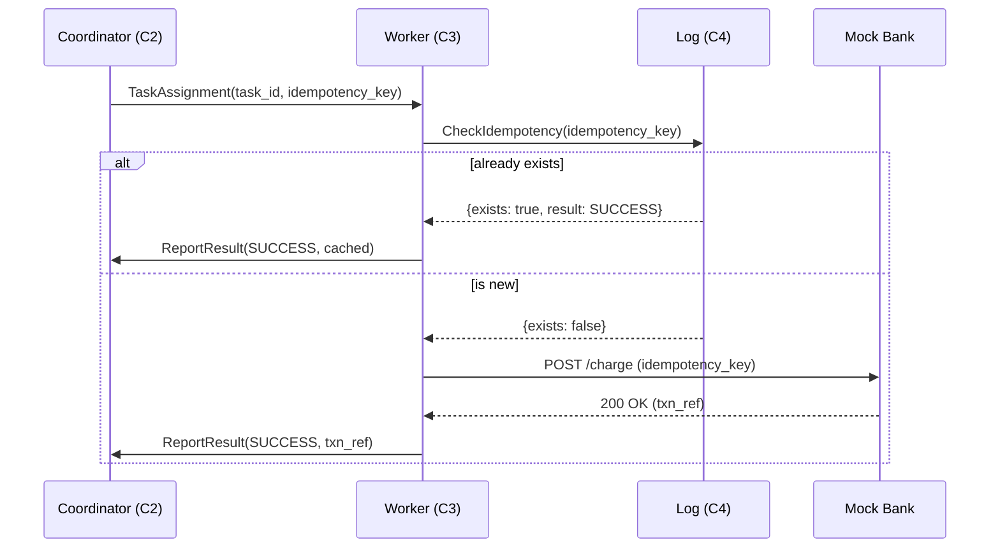
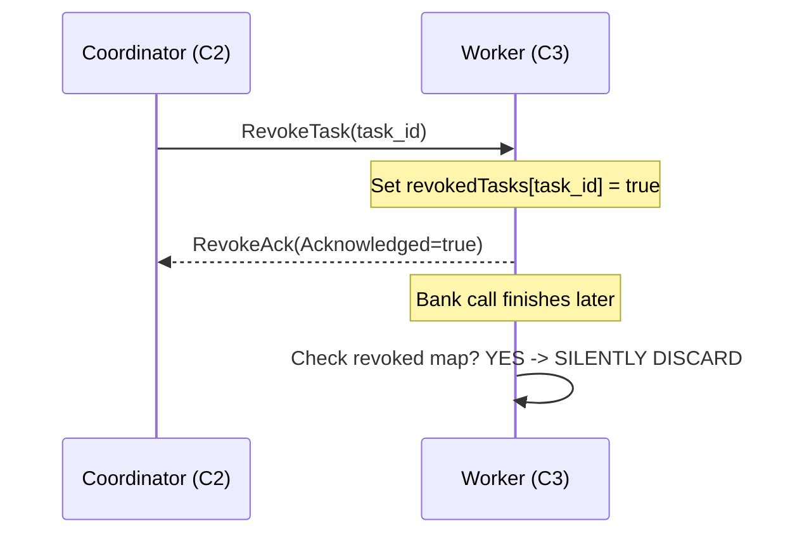

# `worker-service` (C3) — Payment Execution Engine

`worker-service` (C3) is a high-performance, stateless, and horizontally scalable component of the **PayFlow** distributed payment system. It acts as the "hands" of the system, executing payment tasks against external banking APIs while ensuring exactly-once semantics.

---

## 1. High-Level Architecture

The service is built using **Clean Architecture** principles to ensure decoupling between business logic and transport layers.

### Component Diagram



### Internal Layers
-   **Domain (`internal/domain`)**: Core business models (`Task`, `PaymentResult`) and status constants. 100% logic-free.
-   **Service (`internal/service`)**: The "Brain". Implements the exactly-once pipeline, retry logic, and circuit breaking.
-   **Transport (`internal/transport/grpc`)**: The "Interface". Handles gRPC server/client communication, interceptors, and heartbeats.

---

## 2. Protocols & Endpoints

### Hosted gRPC Services (C3 serves these)
| Service | Method | Path | Description |
|---|---|---|---|
| `WorkerManagement` | `RevokeTask` | `/payflow.worker.v1.WorkerManagement/RevokeTask` | Abandon an in-flight task immediately. |
| `Health` | `Check` | `/grpc.health.v1.Health/Check` | Standard gRPC health check. |

### Consumed gRPC Services (C3 calls these)
| Service | Method | Role |
|---|---|---|
| `Coordinator` | `RegisterWorker` | Startup handshake and capability reporting. |
| `Coordinator` | `WorkerHeartbeat` | 2s bidirectional stream for load and health reporting. |
| `Coordinator` | `ReportResult` | Sending final Success/Failure/Error status. |
| `PaymentLog` | `CheckIdempotency` | Mandatory check before any bank call. |

### Observability Endpoints
-   **Prometheus Metrics**: `http://<worker-ip>:9092/metrics`
-   **Key Metrics**:
    -   `worker_active_tasks`: Current parallel executions.
    -   `worker_tasks_total`: Counter by status (`success`, `failure`, `revoked`).
    -   `worker_bank_request_duration_ms`: Latency histogram of bank calls.

---

## 3. Detailed Data Flows

### Sequence 1: Registration & Heartbeat
Workers are self-announcing and maintain active presence via heartbeats.



### Sequence 2: Payment Execution (Exactly-Once)
This flow is strictly ordered to prevent double charges.



### Sequence 3: Task Revocation
C2 can revoke tasks if it detects worker drift or if a timeout occurs.



---

## 4. Team Coordination (M1–M5)

| Role | Interaction Point | Requirements for C3 |
|---|---|---|
| **M1 (Coordinator)** | `Register`, `Heartbeat`, `Revoke`, `Report` | C3 must re-register on C2 restart; Heartbeat must include accurate load. |
| **M2 (Worker)** | *Ourselves* | Implement retry with exponential backoff; prevent double-reporting on revoke. |
| **M3 (Proto/API)** | `worker.proto` | Notify M3 of any schema changes; Keep `task_id` and `idempotency_key` mandatory. |
| **M4 (Log Service)** | `CheckIdempotency` | C3 must NEVER skip C4 check. C4 outage should buffer C3 results. |
| **M5 (Infra/Metrics)** | `Dockerfile`, `Prometheus` | Expose `:9092`; use distroless base image for security. |

---

## 5. Running the Project

### Prerequisites
-   Go 1.22+
-   Docker & Docker Compose (optional but recommended)

### Local Development (Binary)
```bash
# 1. Setup environment
export COORDINATOR_ADDR=localhost:50051
export LOG_SERVICE_ADDR=localhost:50054
export BANK_API_ADDR=http://localhost:8090
export WORKER_ID=dev-worker-1

# 2. Download dependencies
go mod download

# 3. Run the service
go run ./cmd/worker
```

### Full System (Docker Compose)
```bash
# Build and start the worker along with its dependencies
docker compose up worker-1 -d

# Watch logs
docker compose logs -f worker-1
```

---

## 6. Environment Configuration

| Variable | Description | Default |
|---|---|---|
| `WORKER_ID` | Stable identifier for the worker instance. | `uuid.New()` |
| `COORDINATOR_ADDR` | gRPC address of the C2 Coordinator. | **Required** |
| `LOG_SERVICE_ADDR` | gRPC address of the C4 Log Service. | **Required** |
| `BANK_API_ADDR` | HTTP URL for the Mock Bank API. | **Required** |
| `MAX_CONCURRENT_TASKS` | Max tasks this worker can process in parallel. | `5` |
| `HEARTBEAT_INTERVAL` | Time between heartbeats (must be < 6s). | `2s` |
| `BANK_FAIL_RATE` | Simulated failure rate (0.0 to 1.0). | `0.10` |
| `LOG_LEVEL` | Logging verbosity (`debug`, `info`, `warn`, `error`). | `info` |

---

## 7. Manual Testing & Troubleshooting

### Check Health via `grpcurl`
```bash
# Check if the service is serving
grpcurl -plaintext localhost:PORT grpc.health.v1.Health/Check
```

### Manually Revoke a Task
```bash
grpcurl -plaintext \
    -d '{"task_id": "TEST-123"}' \
    localhost:PORT payflow.worker.v1.WorkerManagement/RevokeTask
```

### Monitoring
Check the Prometheus metrics at `http://localhost:9092/metrics` to verify `worker_active_tasks` and `worker_heartbeat_sent_total`.
